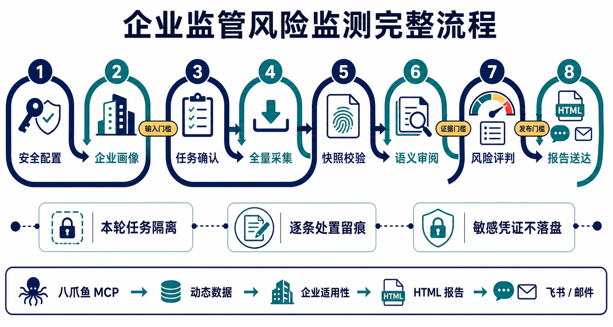

export const landingCss = String.raw`
    :root {
      --primary: #1677ff;
      --primary-deep: #0d47a1;
      --primary-pressed: #0958d9;
      --primary-soft: #e8f4fd;
      --primary-wash: #eff6ff;
      --ink: #172033;
      --text: #344054;
      --muted: #667085;
      --subtle: #98a2b3;
      --border: #e5e7eb;
      --border-blue: #bae0ff;
      --canvas: #ffffff;
      --surface: #f8fafc;
      --success: #15803d;
      --success-bg: #ecfdf3;
      --warning: #b54708;
      --warning-bg: #fff7ed;
      --danger: #b91c1c;
      --danger-bg: #fef2f2;
      --shadow-hero: 0 22px 55px rgba(28, 52, 84, .10);
      --shadow-cta: 0 12px 28px rgba(22, 119, 255, .22);
      --radius-sm: 8px;
      --radius: 12px;
      --radius-lg: 16px;
    }

    * { box-sizing: border-box; }

    html {
      scroll-behavior: smooth;
      background: var(--surface);
    }

    body {
      margin: 0;
      color: var(--text);
      background: var(--canvas);
      font-family: Inter, "PingFang SC", "Microsoft YaHei", "Noto Sans SC", system-ui, -apple-system, BlinkMacSystemFont, "Segoe UI", sans-serif;
      font-size: 16px;
      line-height: 1.72;
      -webkit-font-smoothing: antialiased;
      text-rendering: optimizeLegibility;
    }

    a { color: inherit; }

    img {
      display: block;
      max-width: 100%;
    }

    button,
    a {
      -webkit-tap-highlight-color: transparent;
    }

    :focus-visible {
      outline: 3px solid rgba(22, 119, 255, .28);
      outline-offset: 3px;
    }

    .skip-link {
      position: fixed;
      top: 10px;
      left: 10px;
      z-index: 100;
      transform: translateY(-150%);
      padding: 8px 12px;
      color: var(--canvas);
      border-radius: var(--radius-sm);
      background: var(--primary-deep);
      text-decoration: none;
    }

    .skip-link:focus { transform: translateY(0); }

    .page-shell {
      width: min(1160px, calc(100% - 40px));
      margin: 0 auto;
    }

    .topbar {
      position: sticky;
      top: 0;
      z-index: 50;
      border-bottom: 1px solid rgba(229, 231, 235, .94);
      background: rgba(255, 255, 255, .94);
      backdrop-filter: blur(14px);
    }

    .topbar-inner {
      min-height: 64px;
      display: flex;
      align-items: center;
      justify-content: space-between;
      gap: 28px;
    }

    .brand {
      min-width: 0;
      display: flex;
      align-items: center;
      gap: 13px;
      text-decoration: none;
    }

    .brand-logo {
      width: 225px;
      height: auto;
      flex: 0 1 auto;
    }

    .brand-product {
      flex: 0 0 auto;
      padding-left: 13px;
      color: var(--primary-deep);
      border-left: 1px solid var(--border);
      font-size: 12px;
      font-weight: 700;
      white-space: nowrap;
    }

    .topnav {
      display: flex;
      align-items: center;
      gap: 2px;
      overflow-x: auto;
      color: var(--muted);
      font-size: 13px;
      font-weight: 650;
      scrollbar-width: none;
    }

    .topnav::-webkit-scrollbar { display: none; }

    .topnav a {
      flex: 0 0 auto;
      padding: 8px 10px;
      border-radius: var(--radius-sm);
      text-decoration: none;
      transition: color .18s ease, background .18s ease;
    }

    .topnav a:hover {
      color: var(--primary-deep);
      background: var(--primary-wash);
    }

    .hero {
      overflow: hidden;
      padding: 82px 0 66px;
      background: linear-gradient(180deg, #eef6ff 0%, #f8fbff 44%, #ffffff 100%);
    }

    .hero-copy {
      max-width: 900px;
      margin: 0 auto;
      text-align: center;
    }

    .eyebrow,
    .section-kicker {
      display: inline-flex;
      align-items: center;
      gap: 8px;
      color: var(--primary-deep);
      font-size: 12px;
      font-weight: 750;
      letter-spacing: .055em;
    }

    .eyebrow {
      padding: 6px 11px;
      border: 1px solid var(--border-blue);
      border-radius: 999px;
      background: rgba(255, 255, 255, .86);
    }

    .eyebrow::before {
      content: "";
      width: 7px;
      height: 7px;
      border-radius: 50%;
      background: var(--primary);
      box-shadow: 0 0 0 3px rgba(22, 119, 255, .12);
    }

    h1,
    h2,
    h3,
    p { margin-top: 0; }

    h1,
    h2 {
      overflow-wrap: normal;
      word-break: keep-all;
      hyphens: none;
    }

    h3 {
      overflow-wrap: anywhere;
      word-break: normal;
      hyphens: none;
      text-wrap: pretty;
    }

    h1 {
      max-width: 900px;
      margin: 20px auto 18px;
      color: var(--ink);
      font-size: clamp(42px, 5.2vw, 62px);
      line-height: 1.08;
      letter-spacing: -.05em;
      text-wrap: balance;
    }

    .hero-lead {
      max-width: 830px;
      margin: 0 auto 28px;
      color: var(--muted);
      font-size: clamp(17px, 2vw, 20px);
      line-height: 1.78;
      text-wrap: pretty;
    }

    .hero-lead strong { color: var(--primary-deep); }

    .hero-actions {
      display: flex;
      flex-wrap: wrap;
      justify-content: center;
      gap: 12px;
      margin-bottom: 38px;
    }

    .button {
      min-height: 44px;
      display: inline-flex;
      align-items: center;
      justify-content: center;
      padding: 0 18px;
      border-radius: 10px;
      font-size: 14px;
      font-weight: 700;
      text-decoration: none;
      transition: transform .18s ease, box-shadow .18s ease, background .18s ease;
    }

    .button:hover { transform: translateY(-1px); }

    .button-primary {
      color: var(--canvas);
      background: var(--primary);
      box-shadow: var(--shadow-cta);
    }

    .button-primary:hover { background: var(--primary-pressed); }

    .button-secondary {
      color: var(--primary-deep);
      border: 1px solid #cbd5e1;
      background: var(--canvas);
    }

    .button-secondary:hover {
      border-color: var(--border-blue);
      background: var(--primary-wash);
    }

    .hero-visual {
      overflow: hidden;
      margin: 0;
      padding: 13px;
      border: 1px solid var(--border-blue);
      border-radius: var(--radius-lg);
      background: rgba(255, 255, 255, .94);
      box-shadow: var(--shadow-hero);
    }

    .hero-visual img {
      width: 100%;
      border-radius: var(--radius);
    }

    .hero-caption {
      display: flex;
      align-items: center;
      justify-content: space-between;
      gap: 24px;
      padding: 14px 5px 1px;
      color: var(--muted);
      font-size: 13px;
    }

    .hero-caption strong {
      color: var(--primary-deep);
      font-size: 14px;
    }

    .metrics {
      display: grid;
      grid-template-columns: repeat(4, 1fr);
      gap: 12px;
      margin-top: 16px;
    }

    .metric {
      padding: 18px 16px;
      border: 1px solid var(--border);
      border-radius: var(--radius);
      background: rgba(255, 255, 255, .94);
      text-align: left;
    }

    .metric strong {
      display: block;
      color: var(--primary-deep);
      font-size: 26px;
      line-height: 1.1;
    }

    .metric span {
      color: var(--muted);
      font-size: 13px;
    }

    section[id] { scroll-margin-top: 76px; }

    .section {
      padding: 88px 0;
      border-top: 1px solid #f1f5f9;
    }

    .section-tint { background: var(--surface); }
    .section-blue { background: linear-gradient(180deg, var(--primary-wash), #f8fbff); }

    .section-header {
      display: grid;
      grid-template-columns: minmax(470px, .9fr) minmax(0, 1.1fr);
      align-items: end;
      gap: 42px;
      margin-bottom: 32px;
    }

    .section-kicker {
      margin-bottom: 8px;
      text-transform: uppercase;
    }

    .section-header h2,
    .handoff-heading h2,
    .summary-panel h2 {
      margin-bottom: 0;
      color: var(--ink);
      font-size: clamp(26px, 3.1vw, 40px);
      line-height: 1.18;
      letter-spacing: -.045em;
      text-wrap: balance;
    }

    .section-header h2,
    .handoff-heading h2,
    .summary-panel h2,
    .subsection-heading h3 {
      overflow-wrap: normal;
      word-break: keep-all;
    }

    .section-intro {
      margin-bottom: 0;
      color: var(--muted);
      font-size: 16px;
    }

    .positioning-callout {
      display: grid;
      grid-template-columns: minmax(220px, .7fr) minmax(0, 1.3fr);
      gap: 24px;
      margin-bottom: 18px;
      padding: 26px;
      border: 1px solid var(--border-blue);
      border-radius: var(--radius);
      background: var(--primary-wash);
    }

    .positioning-quote {
      color: var(--primary-deep);
      font-size: 21px;
      font-weight: 720;
      line-height: 1.55;
      letter-spacing: -.015em;
    }

    .positioning-copy h3 {
      margin-bottom: 8px;
      color: var(--ink);
      font-size: 20px;
    }

    .positioning-copy p {
      margin-bottom: 9px;
      color: var(--muted);
    }

    .positioning-copy p:last-of-type { margin-bottom: 0; }

    .formula {
      display: flex;
      flex-wrap: wrap;
      align-items: center;
      gap: 7px;
      margin-top: 16px;
      color: var(--primary-deep);
      font-size: 12px;
      font-weight: 700;
    }

    .formula span {
      padding: 5px 8px;
      border: 1px solid var(--border-blue);
      border-radius: 6px;
      background: var(--canvas);
    }

    .formula b { color: var(--primary); }

    .feature-grid,
    .output-grid,
    .value-grid {
      display: grid;
      grid-template-columns: repeat(3, 1fr);
      gap: 14px;
    }

    .feature-grid { margin-top: 18px; }

    .feature-card,
    .output-card,
    .value-card,
    .input-card,
    .boundary-card,
    .handoff-card {
      border: 1px solid var(--border);
      border-radius: var(--radius);
      background: var(--canvas);
    }

    .feature-card {
      position: relative;
      padding: 22px;
    }

    .feature-index {
      display: inline-flex;
      margin-bottom: 16px;
      padding: 3px 7px;
      color: var(--primary);
      border: 1px solid var(--border-blue);
      border-radius: 6px;
      background: var(--primary-wash);
      font-size: 11px;
      font-weight: 750;
      letter-spacing: .08em;
    }

    .feature-card h3,
    .output-card h3,
    .value-card h3,
    .input-card h3,
    .boundary-card h3,
    .handoff-card h3 {
      margin-bottom: 8px;
      color: var(--ink);
      font-size: 17px;
      line-height: 1.42;
    }

    .feature-card p,
    .output-card p,
    .value-card p,
    .input-card p,
    .boundary-card p,
    .handoff-card p {
      margin-bottom: 0;
      color: var(--muted);
      font-size: 14px;
    }

    .feature-card strong { color: var(--primary-deep); }

    .subsection-heading {
      display: flex;
      align-items: baseline;
      justify-content: space-between;
      gap: 24px;
      margin: 46px 0 16px;
    }

    .subsection-heading h3 {
      margin: 0;
      color: var(--ink);
      font-size: 23px;
      letter-spacing: -.02em;
    }

    .subsection-heading p {
      max-width: 650px;
      margin: 0;
      color: var(--muted);
      font-size: 14px;
    }

    .table-wrap {
      overflow-x: auto;
      border: 1px solid var(--border);
      border-radius: var(--radius);
      background: var(--canvas);
    }

    table {
      width: 100%;
      min-width: 780px;
      border-collapse: collapse;
      font-size: 13px;
    }

    th,
    td {
      padding: 14px 16px;
      border-bottom: 1px solid var(--border);
      text-align: left;
      vertical-align: top;
    }

    th {
      color: var(--primary-deep);
      background: #f7fbff;
      font-size: 12px;
      font-weight: 750;
    }

    tbody tr:last-child td { border-bottom: 0; }
    td { color: var(--muted); }
    td strong { color: var(--ink); }

    .tag {
      display: inline-block;
      margin: 2px 4px 2px 0;
      padding: 2px 7px;
      color: var(--primary-deep);
      border: 1px solid var(--border-blue);
      border-radius: 999px;
      background: var(--primary-wash);
      font-size: 11px;
      white-space: nowrap;
    }

    .pain-grid {
      display: grid;
      grid-template-columns: repeat(2, 1fr);
      gap: 14px;
    }

    .pain-card {
      display: grid;
      grid-template-columns: 1fr 32px 1fr;
      align-items: center;
      gap: 12px;
      padding: 20px;
      border: 1px solid var(--border);
      border-radius: var(--radius);
      background: var(--canvas);
    }

    .pain-card h3 {
      margin-bottom: 5px;
      font-size: 15px;
    }

    .pain-card h3.pain { color: var(--danger); }
    .pain-card h3.solution { color: var(--primary-deep); }

    .pain-card p {
      margin-bottom: 0;
      color: var(--muted);
      font-size: 13px;
    }

    .arrow-box {
      width: 30px;
      height: 30px;
      display: grid;
      place-items: center;
      color: var(--primary);
      border-radius: 50%;
      background: var(--primary-wash);
      font-weight: 800;
    }

    .workflow-frame {
      overflow: hidden;
      margin: 0;
      padding: 10px;
      border: 1px solid var(--border-blue);
      border-radius: var(--radius);
      background: var(--canvas);
    }

    .workflow-frame img {
      width: 100%;
      min-width: 900px;
      border-radius: 8px;
    }

    .workflow-scroll { overflow-x: auto; }

    .workflow-hint {
      padding: 9px 4px 0;
      color: var(--muted);
      font-size: 12px;
      text-align: center;
    }

    .gate-grid,
    .security-grid {
      display: grid;
      grid-template-columns: repeat(3, 1fr);
      gap: 12px;
      margin-top: 14px;
    }

    .gate,
    .security-item {
      padding: 18px;
      border: 1px solid var(--border-blue);
      border-radius: var(--radius);
      background: rgba(255, 255, 255, .88);
    }

    .gate strong,
    .security-item strong {
      display: block;
      margin-bottom: 5px;
      color: var(--primary-deep);
      font-size: 14px;
    }

    .gate p,
    .security-item {
      margin-bottom: 0;
      color: var(--muted);
      font-size: 13px;
    }

    .process-grid {
      counter-reset: process;
      display: grid;
      grid-template-columns: repeat(2, 1fr);
      gap: 14px;
      margin-top: 20px;
    }

    .process-card {
      counter-increment: process;
      position: relative;
      padding: 22px 22px 20px 64px;
      border: 1px solid var(--border);
      border-radius: var(--radius);
      background: var(--canvas);
    }

    .process-card::before {
      content: counter(process, decimal-leading-zero);
      position: absolute;
      top: 21px;
      left: 20px;
      width: 32px;
      height: 32px;
      display: grid;
      place-items: center;
      color: var(--canvas);
      border-radius: 9px;
      background: var(--primary);
      font-size: 11px;
      font-weight: 800;
    }

    .process-card h3 {
      margin-bottom: 5px;
      color: var(--ink);
      font-size: 17px;
    }

    .process-summary {
      margin-bottom: 13px;
      color: var(--muted);
      font-size: 13px;
    }

    .process-detail {
      margin: 0;
      padding-top: 10px;
      border-top: 1px solid var(--border);
      color: var(--muted);
      font-size: 13px;
    }

    .process-detail + .process-detail { margin-top: 9px; }

    .process-label {
      color: var(--primary-deep);
      font-weight: 750;
    }

    .risk-layout {
      display: grid;
      grid-template-columns: .82fr 1.18fr;
      gap: 18px;
      align-items: start;
    }

    .evidence-card,
    .risk-panel,
    .action-example {
      border: 1px solid var(--border);
      border-radius: var(--radius);
      background: var(--canvas);
    }

    .evidence-card { padding: 24px; }

    .evidence-card > h3 {
      margin-bottom: 6px;
      color: var(--ink);
      font-size: 20px;
    }

    .evidence-card > p {
      margin-bottom: 18px;
      color: var(--muted);
      font-size: 13px;
    }

    .gate-list { display: grid; gap: 9px; }

    .gate-item {
      display: grid;
      grid-template-columns: 28px 1fr;
      gap: 10px;
      align-items: start;
    }

    .gate-item b {
      width: 27px;
      height: 27px;
      display: grid;
      place-items: center;
      color: var(--primary);
      border: 1px solid var(--border-blue);
      border-radius: 7px;
      background: var(--primary-wash);
      font-size: 11px;
    }

    .gate-item strong {
      display: block;
      color: var(--ink);
      font-size: 13px;
    }

    .gate-item span {
      display: block;
      color: var(--muted);
      font-size: 12px;
    }

    .risk-panel { overflow: hidden; }
    .risk-panel .table-wrap { border: 0; border-radius: 0; }
    .risk-table { min-width: 620px; }

    .severity {
      display: inline-flex;
      padding: 2px 8px;
      border-radius: 999px;
      font-size: 11px;
      font-weight: 750;
      white-space: nowrap;
    }

    .severity.critical,
    .severity.high { color: var(--danger); background: var(--danger-bg); }
    .severity.medium { color: var(--warning); background: var(--warning-bg); }
    .severity.watch { color: var(--primary-deep); background: var(--primary-wash); }
    .severity.na { color: var(--muted); background: #f2f4f7; }

    .principle-note {
      padding: 16px 18px;
      color: var(--muted);
      border-top: 1px solid var(--border);
      background: #fbfdff;
      font-size: 13px;
    }

    .principle-note strong {
      display: block;
      margin-bottom: 4px;
      color: var(--primary-deep);
    }

    .action-example {
      display: grid;
      grid-template-columns: .95fr 1.05fr;
      gap: 0;
      overflow: hidden;
      margin-top: 18px;
    }

    .risk-brief,
    .action-plan { padding: 24px; }

    .risk-brief,
    .action-plan { min-width: 0; }

    .risk-brief {
      border-right: 1px solid var(--border);
      background: #fbfdff;
    }

    .demo-flag {
      display: inline-flex;
      margin-bottom: 14px;
      padding: 3px 7px;
      color: var(--warning);
      border-radius: 6px;
      background: var(--warning-bg);
      font-size: 11px;
      font-weight: 750;
    }

    .risk-brief h3,
    .action-plan h3 {
      margin-bottom: 9px;
      color: var(--ink);
      font-size: 18px;
    }

    .risk-brief p,
    .action-step p {
      color: var(--muted);
      font-size: 13px;
    }

    .why-box {
      margin-top: 16px;
      padding: 15px;
      border-left: 3px solid var(--primary);
      border-radius: 0 8px 8px 0;
      background: var(--primary-wash);
    }

    .why-box strong {
      display: block;
      margin-bottom: 4px;
      color: var(--primary-deep);
      font-size: 13px;
    }

    .why-box p { margin-bottom: 0; }

    .action-step {
      display: grid;
      grid-template-columns: 88px 1fr;
      gap: 12px;
      padding: 11px 0;
      border-bottom: 1px solid var(--border);
    }

    .action-step:last-child { border-bottom: 0; }

    .action-step b {
      color: var(--primary-deep);
      font-size: 12px;
    }

    .action-step p { margin-bottom: 0; }

    .output-card,
    .value-card,
    .input-card { padding: 22px; }

    .output-icon {
      width: 34px;
      height: 34px;
      display: grid;
      place-items: center;
      margin-bottom: 15px;
      color: var(--primary);
      border: 1px solid var(--border-blue);
      border-radius: 9px;
      background: var(--primary-wash);
      font-size: 13px;
      font-weight: 800;
    }

    .value-grid { margin-top: 18px; }

    .measure {
      margin-top: 14px;
      padding-top: 12px;
      color: var(--primary-deep);
      border-top: 1px dashed var(--border-blue);
      font-size: 12px;
      font-weight: 650;
    }

    .input-grid,
    .boundary-grid,
    .handoff-grid {
      display: grid;
      grid-template-columns: repeat(2, 1fr);
      gap: 14px;
    }

    .input-card ul,
    .boundary-card ul {
      margin: 0;
      padding-left: 18px;
      color: var(--muted);
      font-size: 13px;
    }

    .input-card li + li,
    .boundary-card li + li { margin-top: 7px; }

    code {
      padding: 2px 5px;
      color: var(--primary-deep);
      border: 1px solid var(--border-blue);
      border-radius: 5px;
      background: var(--primary-wash);
      font-family: "SFMono-Regular", Consolas, "Liberation Mono", monospace;
      font-size: .92em;
    }

    .boundary-grid { margin-top: 18px; }
    .boundary-card { padding: 22px; }

    .boundary-card.fit { border-top: 3px solid var(--primary); }
    .boundary-card.limit { border-top: 3px solid var(--warning); }

    .summary-panel {
      overflow: hidden;
      padding: 34px;
      color: rgba(255, 255, 255, .78);
      border-radius: var(--radius-lg);
      background: var(--primary-deep);
    }

    .summary-grid {
      display: grid;
      grid-template-columns: 1.2fr .8fr;
      gap: 36px;
      align-items: center;
    }

    .summary-panel h2 { color: var(--canvas); }

    .summary-panel p {
      margin: 14px 0 0;
      color: rgba(255, 255, 255, .78);
    }

    .summary-panel p strong { color: var(--canvas); }

    .summary-list {
      display: grid;
      gap: 8px;
    }

    .summary-list div {
      padding: 10px 12px;
      border: 1px solid rgba(255, 255, 255, .18);
      border-radius: var(--radius-sm);
      background: rgba(255, 255, 255, .08);
      font-size: 13px;
    }

    .handoff-heading {
      max-width: 720px;
      margin: 48px auto 22px;
      text-align: center;
    }

    .handoff-heading h2 { margin-top: 14px; }

    .handoff-heading p {
      margin: 12px 0 0;
      color: var(--muted);
    }

    .handoff-card {
      min-height: 220px;
      display: flex;
      flex-direction: column;
      justify-content: space-between;
      padding: 24px;
      text-decoration: none;
    }

    .knowledge-card {
      transition: border-color .18s ease, background .18s ease;
    }

    .knowledge-card:hover {
      border-color: var(--border-blue);
      background: #fbfdff;
    }

    .handoff-icon {
      width: 34px;
      height: 34px;
      display: grid;
      place-items: center;
      margin-bottom: 28px;
      color: var(--primary);
      border-radius: 9px;
      background: var(--primary-wash);
      font-weight: 800;
    }

    .handoff-link {
      color: var(--primary);
      font-size: 13px;
      font-weight: 750;
    }

    .community-card {
      display: grid;
      grid-template-columns: 1fr 118px;
      gap: 24px;
      align-items: center;
      background: var(--primary-wash);
      border-color: var(--border-blue);
    }

    .qr-link {
      display: block;
      color: var(--muted);
      text-align: center;
      text-decoration: none;
      font-size: 10px;
    }

    .qr-link img {
      width: 110px;
      height: 110px;
      margin: 0 auto 7px;
      border: 6px solid var(--canvas);
      border-radius: var(--radius-sm);
    }

    footer {
      padding: 28px 0;
      color: var(--muted);
      border-top: 1px solid var(--border);
      background: var(--surface);
      font-size: 12px;
    }

    .footer-inner {
      display: flex;
      justify-content: space-between;
      gap: 32px;
    }

    .footer-inner strong {
      display: block;
      margin-bottom: 4px;
      color: var(--ink);
    }

    .version { text-align: right; }

    @media (max-width: 980px) {
      .section,
      .hero { padding-top: 68px; padding-bottom: 68px; }

      .section-header,
      .positioning-callout,
      .risk-layout,
      .action-example,
      .summary-grid {
        grid-template-columns: 1fr;
        gap: 18px;
      }

      .feature-grid,
      .output-grid,
      .value-grid { grid-template-columns: repeat(2, 1fr); }

      .section-header { align-items: start; }

      .risk-brief {
        border-right: 0;
        border-bottom: 1px solid var(--border);
      }

      .summary-grid { gap: 24px; }
    }

    @media (max-width: 680px) {
      .page-shell { width: min(100% - 28px, 1160px); }

      .topbar-inner {
        min-height: 0;
        display: block;
      }

      .brand {
        height: 58px;
        border-bottom: 1px solid var(--border);
      }

      .brand-logo { width: min(220px, calc(100vw - 46px)); }
      .brand-product { display: none; }

      .topnav {
        width: calc(100vw - 28px);
        height: 42px;
      }

      section[id] { scroll-margin-top: 108px; }

      .hero { padding: 52px 0 50px; }
      .section { padding: 56px 0; }

      h1 {
        margin-top: 17px;
        font-size: clamp(36px, 10vw, 44px);
      }

      .hero-lead { font-size: 16px; }

      .hero-actions {
        display: grid;
        grid-template-columns: 1fr;
        margin-bottom: 28px;
      }

      .hero-caption {
        display: block;
        padding-top: 11px;
      }

      .hero-caption span {
        display: block;
        margin-top: 3px;
      }

      .metrics,
      .feature-grid,
      .pain-grid,
      .gate-grid,
      .process-grid,
      .output-grid,
      .value-grid,
      .input-grid,
      .security-grid,
      .boundary-grid,
      .handoff-grid {
        grid-template-columns: 1fr;
      }

      .metrics { grid-template-columns: repeat(2, 1fr); }

      .metric { padding: 15px; }

      .section-header { margin-bottom: 24px; }

      .section-header h2,
      .handoff-heading h2,
      .summary-panel h2 {
        font-size: clamp(25px, 7.4vw, 30px);
        letter-spacing: -.04em;
      }

      .positioning-callout,
      .summary-panel { padding: 22px; }

      .subsection-heading {
        display: block;
        margin-top: 38px;
      }

      .subsection-heading h3 {
        font-size: clamp(19px, 5.4vw, 21px);
        line-height: 1.4;
        letter-spacing: -.025em;
      }

      .subsection-heading p { margin-top: 7px; }

      .pain-card {
        grid-template-columns: 1fr;
        gap: 9px;
      }

      .arrow-box { transform: rotate(90deg); }

      .workflow-frame { padding: 8px; }

      .process-card { padding-left: 58px; }

      .action-step { grid-template-columns: 78px 1fr; }

      .community-card { grid-template-columns: 1fr; }

      .qr-link {
        width: 118px;
        margin-top: 8px;
      }

      .footer-inner { display: block; }
      .version { margin-top: 15px; text-align: left; }
    }

    @media (prefers-reduced-motion: reduce) {
      html { scroll-behavior: auto; }
      *,
      *::before,
      *::after {
        scroll-behavior: auto !important;
        transition-duration: .01ms !important;
      }
    }

    @media print {
      @page { margin: 14mm; }

      html,
      body {
        color: #000;
        background: #fff;
        font-size: 10pt;
      }

      .topbar,
      .skip-link,
      .hero-actions,
      .handoff-heading,
      .handoff-grid,
      footer { display: none !important; }

      .hero,
      .section {
        padding: 12mm 0;
        background: #fff !important;
        border-top: 1px solid #ddd;
      }

      .hero { padding-top: 0; border-top: 0; }

      .page-shell { width: 100%; }

      .feature-card,
      .pain-card,
      .process-card,
      .gate,
      .output-card,
      .value-card,
      .input-card,
      .boundary-card,
      .positioning-callout,
      .hero-visual,
      .workflow-frame,
      .evidence-card,
      .risk-panel,
      .action-example,
      .summary-panel,
      tr {
        break-inside: avoid;
        box-shadow: none !important;
      }

      .summary-panel {
        color: #000;
        border: 1px solid #aaa;
        background: #fff;
      }

      .summary-panel h2,
      .summary-panel p,
      .summary-panel p strong { color: #000; }

      .workflow-frame { overflow: visible; }
      .workflow-frame img { min-width: 0; }

      a { text-decoration: none; }
    }

header#navbar.is-custom { display: none !important; }
.regulatory-risk-landing-root { width: 100%; }`;

export const landingHtml = String.raw`
  <a class="skip-link" href="#main-content">跳到主要内容</a>

  <header class="topbar">
    

      <a class="brand" href="#main-content" aria-label="八爪鱼采集器监管风险监测首页">
        
        监管风险监测
      </a>
      <nav class="topnav" aria-label="页面目录">
        <a href="#capabilities">核心能力</a>
        <a href="#scenarios">适用场景</a>
        <a href="#workflow">完整流程</a>
        <a href="#standards">评判标准</a>
        <a href="#delivery">输出与边界</a>
      </nav>
    

  </header>

  <main id="main-content">
    <section class="hero">
      

        

          B2B 合规监测 · 八爪鱼 MCP 动态数据 · 自动化交付
          <h1>监管风险，发现即行动</h1>
          

            <strong>financial-regulatory-risk-monitor</strong> 将动态监管数据与客户确认的企业画像逐条匹配，
            输出“<strong>风险点—判断依据—落地策略</strong>”闭环 HTML 报告，并通过飞书或邮件送达。
          

          

            <a class="button button-primary" href="#workflow">查看完整流程</a>
            <a class="button button-secondary" href="#delivery">了解输出与价值</a>
          

        

        <figure class="hero-visual">
          
          <figcaption class="hero-caption">
            <strong>动态数据 × 企业画像 × 证据门槛 × 可执行策略</strong>
            不是简单关键词预警，而是企业适用性判断与行动闭环。
          </figcaption>
        </figure>

        

          
<strong>8</strong>个标准处理步骤

          
<strong>3</strong>道质量与发布门槛

          
<strong>5</strong>档风险等级

          
<strong>2</strong>种企业送达通道

        

      

    </section>

    <section id="capabilities" class="section">
      

        

          

            
Core capabilities

            <h2>从信息监测到风险决策</h2>
          

          

            面向合规、法务和风险管理团队，不只回答“发生了什么”，还要解释为什么与本企业有关、风险在哪里、下一步怎么做。
          

        

        

          
监管信息不是越多越好，真正有价值的是：适用、可信、可追溯、能行动。

          

            <h3>以企业画像为基准建立完整证据链</h3>
            
读取不固定字段、不固定数量的采集数据，对每条记录建立来源、效力、适用性、义务、后果和企业暴露证据链。

            
只有满足证据门槛的事项才进入正式风险区；证据不足的信息进入“待核实”，行政处罚不会被错误表述为客户企业已经违法。

            

              监管数据<b>×</b>企业画像<b>×</b>语义审阅<b>×</b>证据门槛<b>=</b>可执行风险情报
            

          

        

        

          <article class="feature-card">
            01
            <h3>本轮任务严格隔离</h3>
            
只分析当前确认的任务与本轮导出快照，以来源快照和哈希校验避免旧任务、旧报告或缓存混入。

          </article>
          <article class="feature-card">
            02
            <h3>动态字段稳定处理</h3>
            
自动识别标题、机关、日期、正文、文号、处罚依据和原始链接等语义字段，同时保留原始字段。

          </article>
          <article class="feature-card">
            03
            <h3>全量逐条语义审阅</h3>
            
不是抽样或关键词索引；每条证据索引都必须有唯一处置结果，候选风险与待核实项完成正文审阅并留痕。

          </article>
          <article class="feature-card">
            04
            <h3>企业画像驱动适用性</h3>
            
将地区、机构类型、牌照、业务、产品、客户、渠道、数据处理与外包等画像字段逐项匹配。

          </article>
          <article class="feature-card">
            05
            <h3>证据门槛约束高风险</h3>
            
严重或高风险必须具备官方来源、完整正文、明确适用依据和画像命中字段；低置信度信息只能待核实。

          </article>
          <article class="feature-card">
            06
            <h3>从风险描述到行动闭环</h3>
            
明确风险点、原因、责任人、完成时间和交付物，并通过飞书固定用户/群组或 SMTP 邮件送达。

          </article>
        

        

          <h3>适合哪些团队</h3>
          
适合已经能够获取监管或政务数据，却仍需大量人工判断“是否与本企业相关”的组织。

        

        

          <table>
            <thead>
              <tr>
                <th>角色 / 组织</th>
                <th>典型职责</th>
                <th>适合场景</th>
                <th>主要收益</th>
              </tr>
            </thead>
            <tbody>
              <tr>
                <td><strong>企业合规与法务</strong></td>
                <td>法规跟踪、义务识别、整改推动</td>
                <td>政策更新消费者保护数据合规</td>
                <td>把广泛政策压缩成企业适用事项和行动清单</td>
              </tr>
              <tr>
                <td><strong>风险管理与内审</strong></td>
                <td>风险识别、控制评估、审计追踪</td>
                <td>处罚模式内控要求整改验证</td>
                <td>获得带来源、画像命中和处置记录的审计链</td>
              </tr>
              <tr>
                <td><strong>金融机构及分支机构</strong></td>
                <td>属地监管响应、牌照与业务合规</td>
                <td>监管公告行政处罚报送要求</td>
                <td>按地区、牌照、产品和渠道识别直接适用风险</td>
              </tr>
              <tr>
                <td><strong>产业园区、协会与集团总部</strong></td>
                <td>成员企业服务、区域政策研判</td>
                <td>地方公文行业政策风险提示</td>
                <td>以不同画像复用同一数据源，形成差异化提示</td>
              </tr>
              <tr>
                <td><strong>政务与数据服务商</strong></td>
                <td>数据产品、咨询交付、客户运营</td>
                <td>监管情报客户报告订阅服务</td>
                <td>把数据交付升级为场景化风险服务</td>
              </tr>
              <tr>
                <td><strong>Agent / SaaS 方案提供商</strong></td>
                <td>能力封装、自动化工作流、渠道集成</td>
                <td>Skill 集成私有流程自动送达</td>
                <td>复用标准输入、评判门槛、报告与交付链路</td>
              </tr>
            </tbody>
          </table>
        

      

    </section>

    <section id="scenarios" class="section section-tint">
      

        

          

            
Use cases

            <h2>从找到信息到推动行动</h2>
          

          
传统监测往往停在“找到信息”。本 Skill 重点补齐从信息到判断、再从判断到执行之间的断层。

        

        

          <article class="pain-card">
            
<h3 class="pain">政策多、更新快</h3>
人工浏览效率低，重要内容容易淹没。

            
→

            
<h3 class="solution">任务化全量采集</h3>
执行客户现有任务，轮询并导出本轮全量数据。

          </article>
          <article class="pain-card">
            
<h3 class="pain">模板字段不固定</h3>
固定脚本容易漏字段或失效。

            
→

            
<h3 class="solution">动态语义归一化</h3>
识别字段含义并保留原始字段。

          </article>
          <article class="pain-card">
            
<h3 class="pain">关键词误报严重</h3>
标题命中不等于形成义务或适用于企业。

            
→

            
<h3 class="solution">全量语义审阅</h3>
逐条检查正文、效力、主体、地区、业务和时间。

          </article>
          <article class="pain-card">
            
<h3 class="pain">不知道“与我何干”</h3>
通用摘要缺少企业牌照、客户和渠道上下文。

            
→

            
<h3 class="solution">企业画像匹配</h3>
每条结论回指画像命中字段与适用逻辑。

          </article>
          <article class="pain-card">
            
<h3 class="pain">分析很长，措施很空</h3>
管理层看不清重点，执行团队不知道先做什么。

            
→

            
<h3 class="solution">行动化表达</h3>
强制输出风险点、原因、责任人、时限和交付物。

          </article>
          <article class="pain-card">
            
<h3 class="pain">报告生成后无人跟进</h3>
文件停留在本地，缺少固定对象和送达机制。

            
→

            
<h3 class="solution">双通道发布</h3>
HTML 通过飞书固定对象或 SMTP 邮件送达。

          </article>
        

      

    </section>

    <section id="workflow" class="section section-blue">
      

        

          

            
End-to-end workflow

            <h2>八步标准处理流程</h2>
          

          
连接、采集、分析、报告和送达形成闭环；输入、证据、发布三道门槛控制完整性、可信度和自动发布安全。

        

        <figure class="workflow-frame">
          

            
          

          <figcaption class="workflow-hint">移动端可在图内左右滑动，查看八个完整步骤。</figcaption>
        </figure>

        

          <article class="gate">
            <strong>输入门槛</strong>
            
API-Key、企业画像、当前任务及送达配置必须由用户逐项提供或确认。

          </article>
          <article class="gate">
            <strong>证据门槛</strong>
            
高风险和严重风险必须有官方来源、完整正文、适用依据与画像命中字段。

          </article>
          <article class="gate">
            <strong>发布门槛</strong>
            
任务、报告、渠道、收件人与报告指纹全部校验通过后才允许自动发送。

          </article>
        

        

          <h3>每一步都有输入、校验和产物</h3>
          
标准化过程便于其他 Agent 稳定调用，也让客户可以审计结果来源。

        

        

          <article class="process-card">
            <h3>安全连接</h3>
            
连接八爪鱼采集器 MCP。

            
输入：MCP 地址、客户 API-Key。

            
校验：仅采用 API-Key 授权，凭证只在运行时使用；不以 OAuth 或 Bearer Token 替代。

          </article>
          <article class="process-card">
            <h3>确认企业画像</h3>
            
建立企业适用性判断基准。

            
输入：地区、主体、牌照、业务、产品、客户、渠道、治理和数据活动。

            
校验：正式使用由客户确认画像；合成画像仅用于演示并明确标识。

          </article>
          <article class="process-card">
            <h3>锁定当前任务</h3>
            
明确本次分析边界。

            
输入：任务名或 taskId、任务角色。

            
校验：精确解析本轮确认的任务，不自动并入此前执行的其他任务。

          </article>
          <article class="process-card">
            <h3>执行全量采集</h3>
            
获取不固定结构的最新数据。

            
输入：一个或多个当前任务。

            
校验：可并行启动，按节奏轮询至完成，导出本轮全量 JSON 并记录状态。

          </article>
          <article class="process-card">
            <h3>建立来源快照</h3>
            
证明数据确属本轮执行。

            
输入：任务状态、导出文件、来源 URL。

            
校验：重算 SHA-256，把任务、快照、文件和时间绑定，防止旧文件冒充当前结果。

          </article>
          <article class="process-card">
            <h3>归一化与逐条审阅</h3>
            
把动态数据变成完整证据索引。

            
输入：动态结构的全量采集记录。

            
校验：字段映射、重复合并、正文审阅；每条记录必须获得唯一处置结果。

          </article>
          <article class="process-card">
            <h3>专业风险评判</h3>
            
区分风险等级与判断置信度。

            
输入：官方证据、企业画像、语义审阅台账。

            
校验：依次检查来源、效力、适用性、义务、后果和暴露；证据不足则降级或待核实。

          </article>
          <article class="process-card">
            <h3>报告与送达</h3>
            
把结论转化为管理动作。

            
输出：单文件 HTML 报告、发送回执、内部审阅与指纹记录。

            
校验：结构、证据、收件人、渠道与重复发送防护通过后，发送飞书或邮件。

          </article>
        

      

    </section>

    <section id="standards" class="section">
      

        

          

            
Professional judgement

            <h2>证据约束下的专业评判</h2>
          

          
参考 ISO 37301、ISO 31000 与中国企业合规管理的一般原则，采用“规则门槛 + 专业判断”，不依赖不透明的自由打分。

        

        

          <article class="evidence-card">
            <h3>六项证据门槛</h3>
            
按固定顺序判断，避免“看到处罚就判高风险”。

            

              
<b>1</b>
<strong>来源真实性</strong>监管机关、官方链接、正文完整性

              
<b>2</b>
<strong>效力状态</strong>现行、未来生效、失效、征求意见或一般通知

              
<b>3</b>
<strong>适用性</strong>地区、主体、牌照、业务、产品与时间是否匹配

              
<b>4</b>
<strong>义务性质</strong>禁止、必须、报送、整改、内控、消费者保护或倡导

              
<b>5</b>
<strong>风险后果</strong>经营限制、许可影响、处罚、经济损失与声誉影响

              
<b>6</b>
<strong>企业暴露</strong>画像是否包含触发义务的业务活动或控制缺口

            

          </article>

          <article class="risk-panel">
            

              <table class="risk-table">
                <thead>
                  <tr><th>等级</th><th>进入条件</th><th>报告处理</th></tr>
                </thead>
                <tbody>
                  <tr>
                    <td>严重</td>
                    <td>直接适用的强制义务，后果涉及许可、经营限制或重大处罚</td>
                    <td>进入管理层摘要，给出优先行动、负责人、时限与交付物</td>
                  </tr>
                  <tr>
                    <td>高</td>
                    <td>直接适用，且存在明确整改、报送、内控或消费者保护要求</td>
                    <td>列为近期整改事项，并附完整证据和画像命中字段</td>
                  </tr>
                  <tr>
                    <td>中</td>
                    <td>条件性适用，仍需补充牌照、产品、规模或控制措施信息</td>
                    <td>列出待确认信息，并给出验证路径和临时控制措施</td>
                  </tr>
                  <tr>
                    <td>观察</td>
                    <td>反映监管方向或执法趋势，但暂未形成直接义务</td>
                    <td>进入趋势观察，设置复查触发条件，不制造虚假紧迫感</td>
                  </tr>
                  <tr>
                    <td>不适用</td>
                    <td>主体、地区、业务、产品或时间条件明确不匹配</td>
                    <td>保留处置理由，避免同一事项重复进入风险列表</td>
                  </tr>
                </tbody>
              </table>
            

            

              <strong>风险等级与判断置信度分开呈现。</strong>
              低置信度信息只能进入“待核实”，不得列为高风险或严重风险。行政处罚用于识别监管关注点和后果，不能直接推导普遍义务或声称客户企业已经违法。
            

          </article>
        

        

          <h3>把结论压缩成<wbr>“风险点—为什么—举措”</h3>
          
重要发现必须落实到责任人、时限和交付物，便于直接进入整改会议与任务管理。

        

        

          <article class="risk-brief">
            表达示意｜非真实监管结论
            <h3>风险点：<wbr>线上金融服务页面的<wbr>费用与投诉信息<wbr>可能披露不完整</h3>
            
企业画像显示：面向个人客户提供线上金融服务，并通过自有网站及合作渠道完成产品展示与转化。

            

              <strong>为什么有风险</strong>
              
监管文件对适用主体、线上销售场景和消费者信息披露提出明确要求；地区、业务、客户与渠道画像均命中。若页面或合作渠道未同步落实，可能形成消费者保护与内控整改风险。

            

          </article>
          <article class="action-plan">
            <h3>我们的举措：可执行策略</h3>
            
<b>D+3 盘点</b>
<strong>责任：</strong>合规牵头，产品与渠道配合。<strong>交付：</strong>线上页面、落地页和合作渠道清单。

            
<b>D+7 核验</b>
<strong>责任：</strong>法务与消费者保护团队。<strong>交付：</strong>义务—页面字段对照表、缺口与依据链接。

            
<b>D+10 整改</b>
<strong>责任：</strong>产品、设计与渠道运营。<strong>交付：</strong>更新页面、合作方通知和上线审批记录。

            
<b>持续验证</b>
<strong>责任：</strong>内控或内审。<strong>交付：</strong>抽检截图、版本记录、投诉渠道证据与复查日期。

          </article>
        

      

    </section>

    <section id="delivery" class="section section-tint">
      

        

          

            
Outputs & value

            <h2>可阅读、可审计、可送达</h2>
          

          
客户可见输出聚焦可读、可转发的 HTML 报告；审阅台账、来源指纹和发送回执在内部保留，用于质量控制和审计。

        

        

          <article class="output-card">
            
H

            <h3>HTML 风险报告</h3>
            
包含管理层摘要、画像卡片、风险统计、分级表、逐项证据、处罚模式、待确认信息和免责声明。

          </article>
          <article class="output-card">
            
@

            <h3>SMTP 直接邮件</h3>
            
引导填写 SMTP 服务、账号、授权码与收件人，客户无需安装飞书 CLI，校验通过后自动发送。

          </article>
          <article class="output-card">
            
↗

            <h3>飞书固定触达</h3>
            
连接 lark-cli 后发布给指定用户或群组；首次配置后按发布门槛执行，不重复询问。

          </article>
        

        

          <h3>内部控制产物</h3>
          
在不增加客户阅读负担的前提下，保留完整处理与发送证据。

        

        

          <table>
            <thead><tr><th>产物</th><th>作用</th><th>客户可见性</th></tr></thead>
            <tbody>
              <tr>
                <td><strong>语义审阅台账</strong></td>
                <td>证明每条索引记录都有唯一处置结果，候选与待核实项已完成正文审阅</td>
                <td>默认内部保留，必要时用于审计说明</td>
              </tr>
              <tr>
                <td><strong>来源快照与 SHA-256</strong></td>
                <td>绑定当前任务、导出时间与实际文件，防止旧数据混入</td>
                <td>报告展示来源摘要，完整清单内部保留</td>
              </tr>
              <tr>
                <td><strong>报告指纹与发送回执</strong></td>
                <td>阻止相同任务快照、画像和收件人组合被重复发送</td>
                <td>发送状态可见，底层账本内部保留</td>
              </tr>
            </tbody>
          </table>
        

        

          <h3>价值落到可持续衡量的流程指标</h3>
          
不虚构固定 ROI，重点衡量审阅覆盖、证据完整、行动闭环和送达效率。

        

        

          <article class="value-card">
            <h3>从信息数量转向适用事项</h3>
            
减少无关地区、主体、业务和失效文件的筛查投入，把注意力留给真正命中的事项。

            
不适用处置率 · 待核实时长 · 有效风险占比

          </article>
          <article class="value-card">
            <h3>降低误报与无依据升级</h3>
            
高风险受证据门槛约束，风险等级与置信度分离，减少标题命中造成的误报。

            
高风险证据完整率 · 错误升级数

          </article>
          <article class="value-card">
            <h3>形成可复核的判断链</h3>
            
结论可回溯到官方原文、来源快照、画像命中字段和处置理由。

            
结论可追溯率 · 抽查一次通过率

          </article>
          <article class="value-card">
            <h3>缩短从发现到行动的距离</h3>
            
每项风险配套责任人、时限和交付物，可直接进入整改会议和管理层沟通。

            
风险到责任人时间 · 按期完成率

          </article>
          <article class="value-card">
            <h3>将采集能力产品化</h3>
            
结合企业画像形成可销售、可订阅、可复制的场景化服务，而非只交付原始数据。

            
画像复用数 · 报告周期 · 客户续用率

          </article>
          <article class="value-card">
            <h3>便于其他 Agent 稳定复用</h3>
            
标准输入、门槛、脚本与输出结构已封装，无需重新发明评判与送达流程。

            
成功执行率 · 人工补充次数 · 重复发送拦截数

          </article>
        

      

    </section>

    <section id="requirements" class="section">
      

        

          

            
Inputs & boundaries

            <h2>开始前需要确认的输入</h2>
          

          
Skill 不假设采集和送达环境已经配置。首次执行会逐项引导填写，所有关键输入必须询问或确认。

        

        

          <article class="input-card">
            <h3>1. 采集连接</h3>
            <ul>
              <li>八爪鱼 MCP 地址：<code>https://mcp.bazhuayu.com/</code></li>
              <li>客户自己的 API-Key</li>
              <li>仅 API-Key 授权，不切换 OAuth 或 Bearer Token</li>
            </ul>
          </article>
          <article class="input-card">
            <h3>2. 企业画像</h3>
            <ul>
              <li>公司类型、经营地区、牌照与业务活动</li>
              <li>产品服务、客户类型、销售与合作渠道</li>
              <li>消费者保护、数据处理、技术外包、反洗钱与治理特征</li>
            </ul>
          </article>
          <article class="input-card">
            <h3>3. 当前采集任务</h3>
            <ul>
              <li>本轮任务名或 taskId</li>
              <li>任务角色：监管公告、处罚、地方公文等</li>
              <li>每次只分析当前确认的最新任务</li>
            </ul>
          </article>
          <article class="input-card">
            <h3>4. 送达配置</h3>
            <ul>
              <li>飞书：固定用户或群组、lark-cli 登录状态</li>
              <li>邮件：SMTP 服务、端口、账号、授权码与收件人</li>
              <li>自动发送开关以及抄送、密送名单</li>
            </ul>
          </article>
        

        

          
<strong>密钥不写入 Skill</strong>API-Key、SMTP 授权码等仅在运行时提供，不进入分发包。

          
<strong>发送前自动校验</strong>渠道认证失效、收件人错误、证据不足或任务失败时不发送正式报告。

          
<strong>重复发送防护</strong>任务快照、企业画像和收件人组合生成报告指纹，避免同一版本误发两次。

        

        

          <h3>适用边界</h3>
          
提供决策支持与流程加速，不替代持证律师出具的正式法律意见。

        

        

          <article class="boundary-card fit">
            <h3>特别适合</h3>
            <ul>
              <li>法规、公文、公告通知和监管规则的企业适用性筛查</li>
              <li>金融行政处罚中的监管关注点、违规模式与后果观察</li>
              <li>地区、牌照、业务和客户差异明显的 B2B 监测场景</li>
              <li>需要 HTML 报告与固定人员/群组自动触达的持续监测</li>
            </ul>
          </article>
          <article class="boundary-card limit">
            <h3>不应直接替代</h3>
            <ul>
              <li>诉讼、行政复议、许可申请等需律师签署的正式意见</li>
              <li>缺少完整正文、官方来源或关键画像时的高风险定性</li>
              <li>将第三方行政处罚直接认定为客户企业已违法</li>
              <li>未经确认扩大任务范围或自动持久化敏感凭证</li>
            </ul>
          </article>
        

      

    </section>

    <section id="summary" class="section section-tint">
      

        

          

            

              <h2>这个 Skill 的真正切入点</h2>
              

                以客户自己的采集任务和企业画像为入口，把不固定的监管数据加工成
                <strong>企业专属、证据充分、重点清晰、措施可落地、可以自动送达</strong>的风险报告。
                它既体现 MCP 的动态数据获取能力，也具备作为 B 端标准化服务持续复用的基础。
              

            

            

              
① 数据与场景关联足够深

              
② 判断标准可解释、可审计

              
③ 输出直接服务管理与整改

              
④ 能被其他 Agent 标准调用

            

          

        

        

          下一步 · 学习与共创
          <h2>继续了解能力，或直接加入共创</h2>
          
阅读 MCP 说明文档了解连接与使用方式；扫码加入渠道群，获取演示、案例与后续共创支持。

        

        

          <a class="handoff-card knowledge-card" href="https://www.bazhuayu.com/docs/zh/mcp" target="_blank" rel="noopener noreferrer" aria-label="打开八爪鱼 MCP 知识库说明文档（新窗口）">
            

              
↗

              <h3>阅读 MCP 知识库</h3>
              
查看八爪鱼 MCP 的连接、鉴权、任务调用与数据使用说明，为后续落地建立统一认知。

            

            打开官方说明 →
          </a>

          

            

              <h3>扫码加入共创群</h3>
              
获取场景沟通、Skill 演示、项目共创与后续使用支持。请使用微信扫码。

            

            <a class="qr-link" href="../../../assets/mcp/cases/financial-regulatory-risk-monitor/assets/community-qr-code.png" target="_blank" rel="noopener noreferrer" aria-label="在新窗口打开渠道二维码大图">
              
              点击可放大二维码
            </a>
          

        

      

    </section>
  </main>

  <footer>
    

      

        <strong>financial-regulatory-risk-monitor</strong>
        企业监管风险监测 Skill 标准说明。本材料用于产品介绍与能力评估，不构成针对任何企业的法律意见。
      

      
标准说明 v1.0 2026-07-23

    

  </footer>
`;

<style dangerouslySetInnerHTML={{ __html: landingCss }} />

